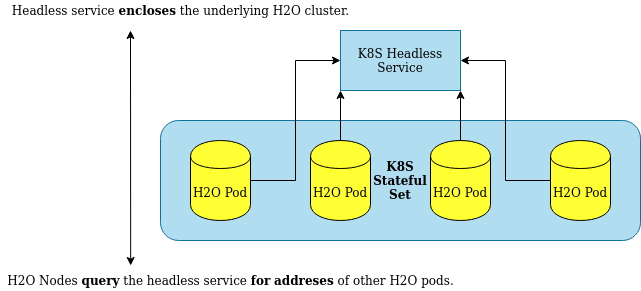

# H2O K8S Clustering Tests

The goal of tests to be found in this directory is to ensure H2O is able to perform
clustering. The process of clustering involves:

1. Start in a Docker container and recognize H2O is ran in K8S environment,
1. Discover other related H2O nodes,
1. Form a cluster/cloud of H2O nodes of given size.

Oftentimes, the process of clustering is also referred to as "clouding".

## DNS Test Scenario

Tests clustering by mens of DNS records of a [Kubernetes service](https://kubernetes.io/docs/concepts/services-networking/service/).
Currently, this is the only scenario tests, as there are no other scenarios supported yet.

Exactly `n` H2O pods (for simplicity and speed `n = 2`) are deployed to a Kubernetes cluster using a Deployment.
A `StatefulSet` is a direct match for stateful applications like H2O, however, at the time this test suite was created,
the `kubectl wait` command did not support `StatefulSet`. Therefore, `Deployment` has been used.

### Test stage definition

A new **nightly** stage named `Kubernetes` has been created in `{h2o-home}/scripts/groovy/defineTestsStages.groovy`.
Every stages in H2O runes inside an H2O container. The `Kubernetes` stage has it's own container named `harbor.h2o.ai/opsh2oai/h2o-3-k8s`. Latest
revision is always used. The image of that docker container is represented by the `Dockerfile` file in this very folder.
Changes can be done by building the container with `docker build . -t harbor.h2o.ai/opsh2oai/h2o-3-k8s` and pushing to `harbor.h2o.ai`.

In that image, a `Docker` is installed together with [k3d](https://github.com/rancher/k3d) by Rancher.
K3S serves as a convenience tool to install [k3s](https://k3s.io/), a lightweight

